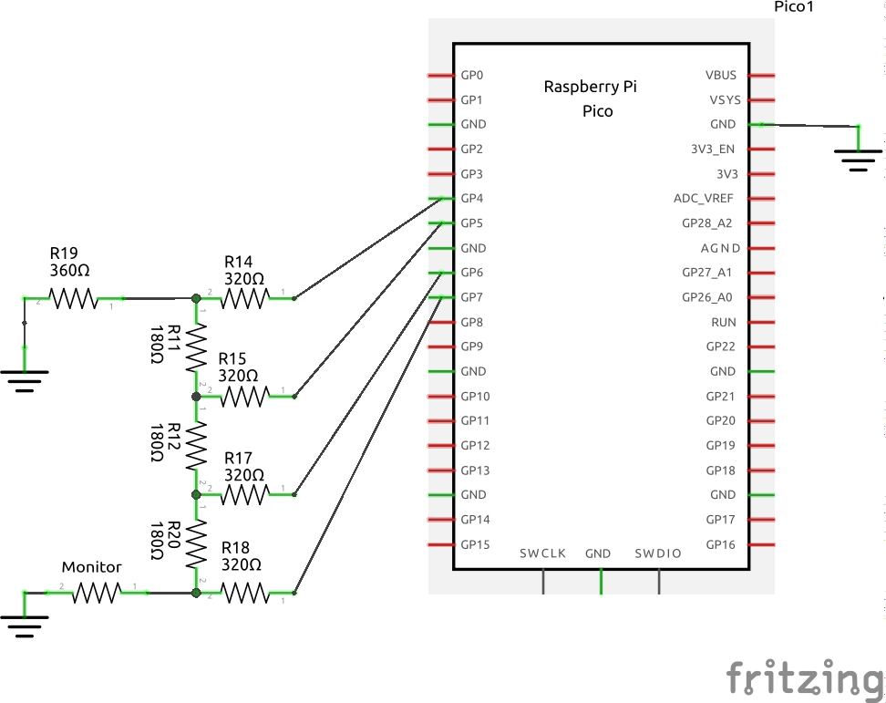

https://user-images.githubusercontent.com/35403929/196324690-8cf68649-8631-45f8-ad35-e8c490187fc7.mp4

# Life
Conway's Game of Life, for the Raspberry Pi Pico, with Composite Video output using an R2R resistor DAC.  Resolution of the 'universe' is 512x384; the speed is approximately 30 generations/second. [Wiki for Multum in Parvo](https://www.conwaylife.com/wiki/Multum_in_parvo)

A modified version of [pico-composite8](https://github.com/obstruse/pico-composite8).

#### 8-Bit R2R Resistor DAC
__*Uses the same DAC as pico-composite8, but only the top four bits are required*__

The input impedance of the Composite Monitor is 75Ω; the output impedance of the R2R ladder is R.  In order to get 1V across a 75Ω load with a 3.3V source, R needs to be 2.3 * 75 = 172.5Ω.  Closest 'standard' values are 180Ω/360Ω.  
Unfortunately using those values doesn't work for 8-bits.  The values are low enough that the internal resistance on the Pico GPIO pins becomes important, and causes visible errors on the 7- and 8-bit.  Measuring the voltage drop on the pins gives a calculated series resistance of about 40Ω, so you will need to reduce the 2R value by that much to compensate.  I used two 160Ω resistors in series:

The R2R DAC will draw about 19mA total from the Pico when all the bits are '1', with a maximum of 6.5mA on any single pin.  Here's the simulation: [R2R DAC Simulation](https://tinyurl.com/yyc6fewc)

#### Seed Patterns
Seed patterns can be downloaded from [LifeWiki](https://www.conwaylife.com/wiki/Category:Patterns).
Save the plaintext pattern file to disk and run `scripts/mkLife.pl name.cells`.  Include the resulting *name.h* file in *cvideo.c* (line 159) and rebuild the executable.

#### the BUG
On some program starts, the Vertical Interlace is 'out of phase' with the monitor - the interlace lines offset in the wrong directions.  Plugging/un-plugging the video cable several times clears it up.  Don't know why it does that.

Any ideas, let me know...

